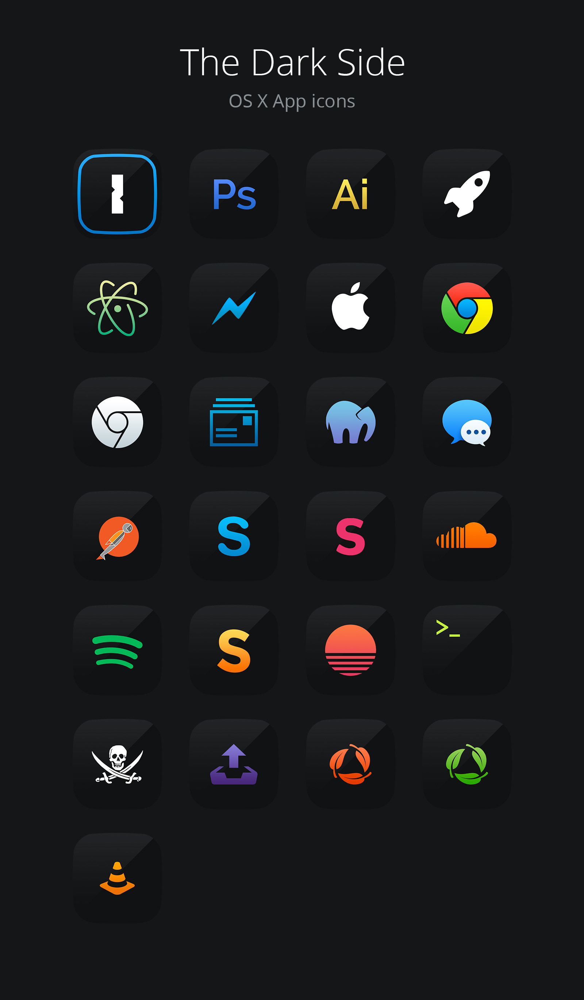

# The Dark Side
Dark app icons for mac OSX in icns and png format.

### Includes icons so far
* 1Password
* Adobe Photoshop
* Adobe Illustrator
* Apple Launcher
* Atom Editor
* Facebook Messenger
* Finder
* Google Chrome
* Google Chrome White
* Mail
* MAMP
* Messages
* Postman
* Skype
* Slack
* Soundcloud
* Spotify
* Sublime Text
* Sunrise Calendar
* Terminal
* Torrent
* Transmit
* Trash
* Trash Full
* VLC Player

### How to install
1. Download [LiteIcons](http://www.freemacsoft.net/liteicon/)
2. Replace icons
3. Apply changes
4. Clear icons cache via *LiteIcons* or run command *"killall -KILL Dock"* in terminal

### Preview

